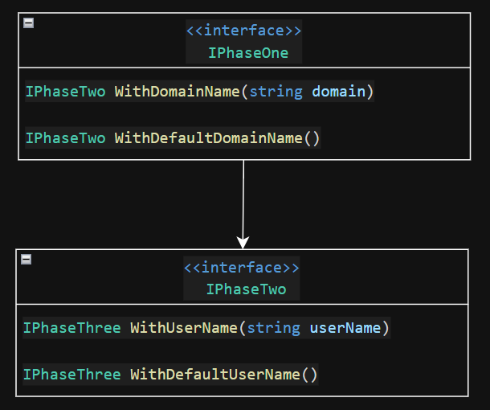

# Fluent API Design

Now that we've got out [functional requirements](../Outcomes/step-1-requirements-analysis.md) in hand, we can begin to lay out the flow of our api.

## Semantic Considerations

Before modeling out API, we want to have an understanding of how our users (application developers) will consume our API. The goal of introducing fluent APIs is to lean on natural-language composition, so that calling the methods in our API feels progressive and compositional.  

In plain english, we can easily describe the ordering of out methods and the general verbiage that we'd like to use. It may seem a little pedantic, but taking a moment to express our desired functionality in plain, relaxed language gives a great foundation for interface design, and also paints a clear picture of the chaining paths that the API is likely to follow.  

```md
Create a database connection with a specified domain name (or use the default value), 
...
```

### Action Item 1

Take a minute to write out the entire API flow, using natural language. No need to worry about punctuation or typos ;)

## Define the interface chains

With our natural-language outline in place, now we can begin to identify how our users will step through our API.  

Typically, each action (or group of options for a given action) represents a single 'phase' of the api.  When reviewing your natural language description, look for qualifiers such as `default`, `or`, `with`, `without`. These tend to describe available options within a phase.  Conditional statements like `if`, `when`, `else`, as well as the conjunection `and` tend to signal transition between phases.

The following example illustrates how we can use interfaces and return types to control transition between phases.



### Common Gotchas

When implementing a phase that allows a user to invoke the same phase method multiple times, always provide a method that explicitly transitions to the next phase.

### Action Item 2

Using your native-language description (if you've completed action item #1) or the [functional requirements](../Outcomes/step-1-requirements-analysis.md) document, model the interfaces that you'll use to build your fluent API.

## Next Steps

- To view the solution to this step, `git checkout step-2-api-design-outcome`
- To continue to the next step, `git checkout step-3-implementation`
