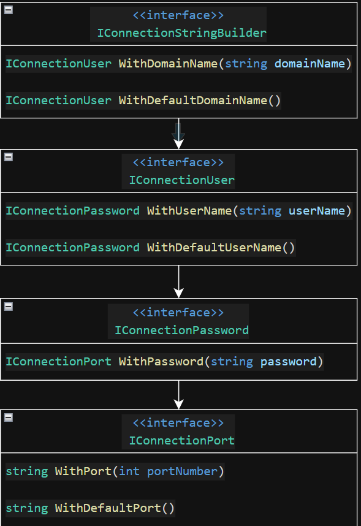

# Step 2:  API Design Outcome

## Action Item 1

Here is one example of how we can craft a natural-language description of our API, based on the functional requirements

```md
API should first allow the user either enter a domain name or use the default domain name. 
Second, the API should allow the user to enter a user name or use the default username.  
Third, the API should require the user to enter a password.
Last, the API should allow the user to enter a port number or use the default port number.
Once the user has provided a port number, the API should return the connection string. 
```

## Action Item 2

Here is one example of how we can model our intefaces using the natural-language description above.



## Example Usage

```csharp
var builder = new Builder();

var connString = builder
    .WithDomainName("my-domain.io")
    .WithUserName("bobby_droptables")
    .WithPassword("Super-Tough-2-Guess-Phrase#")
    .WithPort(5555);
```

## Next Steps

- To continue to the next step, `git checkout step-3-implementation`
